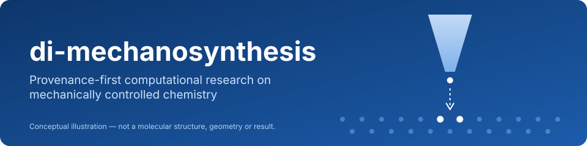
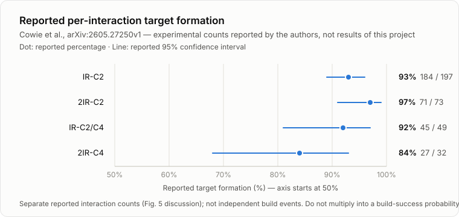
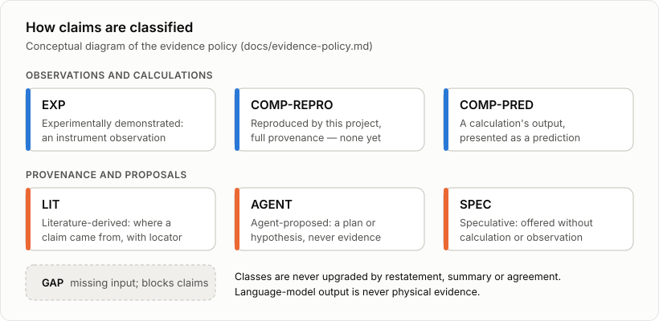
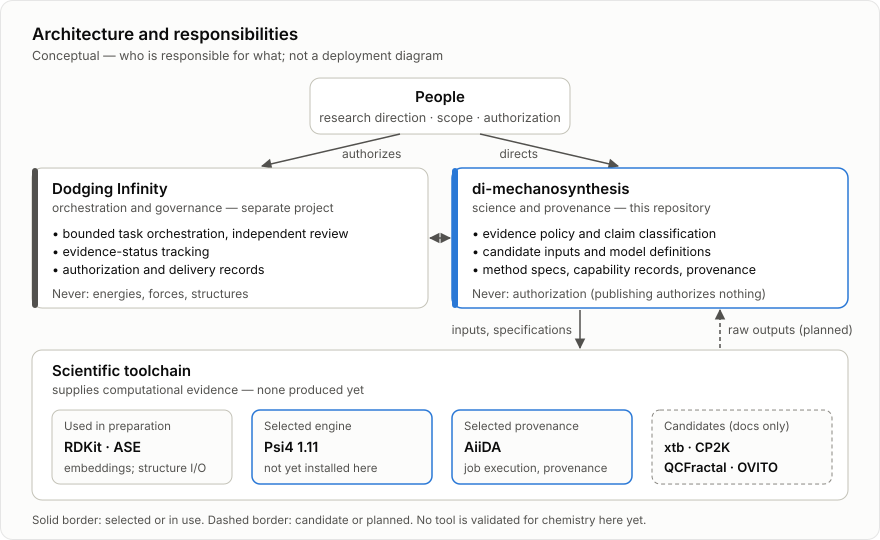

  

# di-mechanosynthesis

**Provenance-first computational research on mechanically controlled chemistry.**

This project studies how chemical reactions driven by precise mechanical positioning can be modelled, tested and
eventually planned, using only reviewed methods and traceable evidence. It is **ongoing research and is revised
routinely** as sources are inspected and evidence changes.

> **Current scope:** the repository holds definitions, candidate input structures, method specifications and
> source-inspection records. It has **no quantum-chemistry results yet** (no energies, forces or populations),
> and it **does not reproduce** the published benchmark described below.
>
> **Sources:** every reference, tool, method source and figure is mapped to direct links, versions, locators and
> limits in [docs/SOURCES.md](docs/SOURCES.md).

---

## The question

Mechanosynthesis is chemistry driven by *position*. Two reagents are brought together mechanically, with
sub-ångström control, so that a bond forms or breaks at one chosen site instead of wherever molecules happen to
meet.

Recent experimental preprints report exactly this with **inverted-mode scanning tunnelling microscopy
(IM-STM)**:
- Tall molecules deposited on a silicon sample image the apex of a flat silicon probe chip.
- The same molecules act as reagents that donate or abstract atoms at that apex ([Barrera et al.][barrera];
  [Cowie et al.][cowie]).
- Cowie et al. report donating C2 units to pre-patterned sites and assembling polyyne structures step by step
  ([Cowie et al.][cowie]).

Experiments like these raise questions that computation should help answer, but only if the computation itself
is trustworthy:
- Which mechanical trajectories lead to the intended bond changes?
- Which competing reactions matter?
- How sensitive is the outcome to how far, how fast and how precisely a tool approaches?

Proposed geometries, model assumptions, software defaults and agent-written summaries can all be mistaken for
results. This program is built to keep them apart.

## Mechanically controlled chemistry, in brief

The terms below are background, paraphrased from the cited preprints.

| Term | Meaning here |
|---|---|
| **Molecular tool** | A molecule that images the probe and is also a reactant. The benchmark tool, **EAOGe-C2I**, is a Ge-substituted adamantane carrying a C2 group with an iodine cap and three OH-terminated legs that anchor it to the Si sample ([Cowie et al.][cowie], section "Mechanosynthetic C2 donation"). |
| **Build site** | The hydrogen-passivated Si(100) apex of the silicon probe chip, pre-patterned with reactive dangling-bond (DB) sites ([Cowie et al.][cowie], abstract and Fig. 5 discussion). |
| **Donation / abstraction** | Transfer of a fragment from the tool to the build site, or removal of an atom from it ([Barrera et al.][barrera]; [Blue et al.][blue]). |
| **Mechanical coordinate** | The controlled separation between tool and build site. In the benchmark's proposed mechanism, a bond forms during approach and a transfer completes on retraction ([Cowie et al.][cowie], Fig. 3). |

## Research aims

These are the program's intended research capabilities, not a schedule. Each stays a hypothesis until it is
supported by reviewed evidence.

- **Mechanical trajectories and reaction primitives.** Describe tool approach, contact and retraction along
  controlled mechanical coordinates, and characterise individual donation or abstraction events as reusable
  *primitives*: defined inputs, defined observables and stated validity limits.
- **Reproducible pathway evaluation.** Evaluate energy landscapes along those coordinates reproducibly: fixed
  inputs, version-matched engines, complete provenance and independent review. Also examine competing and
  off-target channels, and how outcomes depend on approach depth, step size, lateral offset and tool
  conformation.
- **Validated-build planning.** Once primitives are validated, study how they could be sequenced into larger
  atomically precise structures. Manufacturing questions such as throughput, error handling and repair are
  treated strictly as **research hypotheses** until evidence exists. Reported per-interaction counts are never
  multiplied into build-success claims.

## The published benchmark

> **Cowie, M. *et al.*, "Atomically precise mechanosynthesis of carbon structures on hydrogenated Si(100) by
> inverted-mode STM."** arXiv:2605.27250v1, submitted 26 May 2026.
> [doi:10.48550/arXiv.2605.27250](https://doi.org/10.48550/arXiv.2605.27250).

- **Status:** a preprint. No peer-review status is claimed here.
- **Supplementary Information:** the authors state it is available upon request. This project has **not**
  obtained it.

The authors report per-interaction target formation for four build targets. These are **their experimental
counts, not results of this project**.

  

| Target | Reported outcome | Reported percentage | Reported 95% CI |
|---|---|---|---|
| IR-C2 | 184 / 197 | 93% | 89–96% |
| 2IR-C2 | 71 / 73 | 97% | 91–99% |
| IR-C2/C4 | 45 / 49 | 92% | 81–97% |
| 2IR-C4 | 27 / 32 | 84% | 68–93% |

Source: [Cowie et al.][cowie], section "Positional and chemical control of mechanosynthetic donation" (Fig. 5
discussion). These are separate reported interaction counts. They are not independent full-build events and not
a throughput estimate.

The paper also presents a **proposed** IR-C2 formation mechanism from a QM/MM model, xTB (GFN0) with DFT
(ωB97X-D3):
1. The de-iodinated tool is positioned beneath an inter-row dangling-bond pair.
2. A first C–Si bond forms on approach.
3. The Ge–C bond cleaves on retraction, transferring the C2 unit.

The authors present the arrangement shown as one representative leg-binding configuration among several. It is
a computational proposal, distinct from the experimental counts. Details and locators:
[docs/benchmark.md](docs/benchmark.md).

## How evidence is classified

  

Scientific claims are classified by their **underlying evidence**. Where a claim comes from a paper, its
provenance is recorded alongside that class.
- **No upgrading:** a class is never upgraded by restatement, summary, repetition or agreement between agents.
- **Language-model output is never physical evidence.** At most it is a proposal or a speculation.
- **Gaps block claims:** a missing input is marked as a gap, and it blocks every claim that depends on it.

The full policy and the provenance fields required for any future result are in
[docs/evidence-policy.md](docs/evidence-policy.md).

## Architecture

  

Responsibilities are split so that no layer can manufacture evidence for another.

| Layer | Responsible for | Never responsible for |
|---|---|---|
| **People** | Research direction, scope decisions, authorization of consequential work | — |
| **Dodging Infinity** (separate orchestration project) | Bounded task orchestration, independent review, evidence-status tracking, authorization and delivery records | Calculated energies, forces or structures |
| **This repository** | Scientific definitions, candidate inputs, method specifications, capability records, provenance and export manifests | Authorization: publishing a document here authorizes nothing |
| **Scientific toolchain** | Computational evidence: calculated energies, forces, structures and populations, with their raw outputs | Evidence classification, review decisions |

**Tools, by status.** A tool counts as validated only after version-matched checks and review.

| Status | Tools | Role |
|---|---|---|
| **Used in preparation** (no chemistry) | RDKit; ASE | Donor-candidate embeddings; structure building and extxyz input/output |
| **Selected, not yet installed or validated here** | Psi4 1.11 | Electronic-structure engine for the first validation experiment |
| **Selected provenance system** | AiiDA | Scientific job execution and computational provenance |
| **Candidates** (documentation-evaluated only) | xtb | GFN0-xTB, the benchmark's QM/MM partner method; xtb's documentation describes a GFN0 parameter file |
| | CP2K | Periodic and QM/MM engine; its manual documents an internal GFN0-xTB option |
| | tblite | Tight-binding library whose evaluated documentation lists GFN1-xTB, GFN2-xTB and IPEA1-xTB, **not GFN0**, so it is not a substitute for the GFN0 route |
| | QCFractal; OVITO | Alternative workflow store (deferred); rendering of computed coordinates |

## Repository contents

| Path | Contents |
|---|---|
| [docs/SOURCES.md](docs/SOURCES.md) | **Source index:** literature, tool documentation, method sources, structure inputs and all figures, with links, versions, locators and limits |
| [AGENTS.md](AGENTS.md) | Orientation and evidence rules for agents and contributors |
| [docs/benchmark.md](docs/benchmark.md) | Attribution, reported observations and the proposed mechanism, with locators |
| [docs/evidence-policy.md](docs/evidence-policy.md) | Evidence classes, classification rules, provenance requirements |
| [docs/donor-candidates.md](docs/donor-candidates.md) | Donor identity, molecular graph, atom IDs, electron bookkeeping, surface-model definitions |
| [docs/e01-method-specification.md](docs/e01-method-specification.md) | Prospective specification for a first engine-validation experiment, with outcome rules and open clarifications |
| [docs/engine-capability-status.md](docs/engine-capability-status.md) | What archived Psi4 sources support, and what remains unverified |
| [docs/figures/](docs/figures/) | Original SVG diagrams, conceptual unless stated otherwise |
| [structures/](structures/README.md) | Two agent-proposed, unoptimized donor-candidate geometries (49 and 48 atoms) and what they are not |
| [provenance/EXPORT-MANIFEST.md](provenance/EXPORT-MANIFEST.md) | Per-file SHA256, derivation and redaction statements |

## Provenance and reproducibility

- **Hash everything.** Every public file is listed with its SHA256 in the
  [export manifest](provenance/EXPORT-MANIFEST.md), which excludes itself.
- **Adapted is not original.** Where a public file differs from its source record, the manifest says exactly what
  changed and gives the source's hash. A sanitized file is never presented as the original record.
- **Figures come from data.** Charts of numbers are drawn from data tables shown alongside them. Diagrams are
  labelled conceptual, and no invented coordinates, energy profiles or yields are drawn as results.
- **Failures are kept.** Failed and blocked attempts stay recorded, not overwritten.
- **Versions must match.** An engine capability counts only when shown for the exact version used.
  Development-manual pages do not establish what an installed release does.

## Limitations

- **Nothing is reproduced yet.** There is no quantum-chemistry result of any kind, and no reproduction of the
  benchmark's experiments, surface model or mechanism.
- **Donor structures are proposals.** They were built from literature identity statements. They have not been
  compared with the benchmark authors' supplementary coordinates or input archives, which this project has not
  obtained.
- **Engine capabilities and the functional's identity are still open questions** for the selected engine
  version.
- **The export is partial and covers the donor candidates only.** Surface-model coordinate files are omitted;
  their definitions are summarized in [docs/donor-candidates.md](docs/donor-candidates.md). The manifest lists
  every omission and why.

## Participating

Corrections are welcome, especially ones that bring a primary source to bear on something marked unverified.
Please open an issue. Include the exact source (identifier, version, page, section or line) and say which
statement it supports or contradicts. Claims without a checkable source are recorded as proposals, not evidence.
Agents and automated contributors should start with [AGENTS.md](AGENTS.md).

## Licensing status

No license has been selected for this repository yet, so no license is granted here. Third-party works are
cited rather than included. Paper text, figures, supplementary material and vendor source code were excluded
from this export pending redistribution review.

## Citing

The full reference list, with links and the exact sections used, is in [docs/SOURCES.md](docs/SOURCES.md).
Please cite the benchmark preprint directly:
- Cowie, M. *et al.* Atomically precise mechanosynthesis of carbon structures on hydrogenated Si(100) by
  inverted-mode STM. arXiv:2605.27250 (2026). doi:10.48550/arXiv.2605.27250.

Related preprints:
- Barrera, E. *et al.* Inverted-Mode Scanning Tunneling Microscopy for Atomically Precise Fabrication.
  arXiv:2512.24431 (2025). doi:10.48550/arXiv.2512.24431.
- Blue, B. *et al.* Towards Atom-by-Atom Fabrication: Mechanosynthetic donation and abstraction.
  arXiv:2606.13876 (2026). doi:10.48550/arXiv.2606.13876.

[cowie]: https://arxiv.org/abs/2605.27250
[barrera]: https://arxiv.org/abs/2512.24431
[blue]: https://arxiv.org/abs/2606.13876
