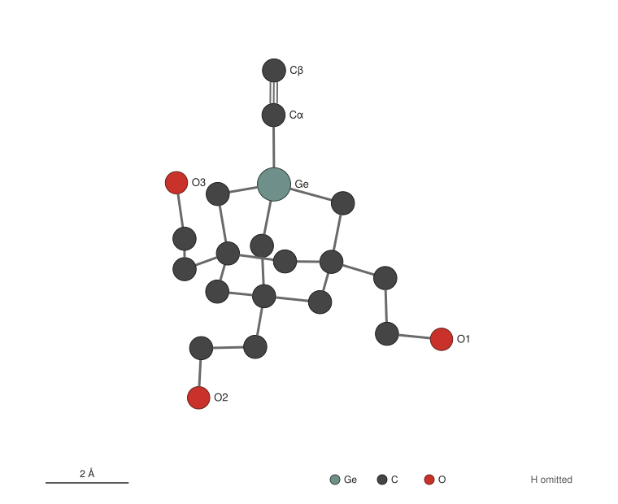
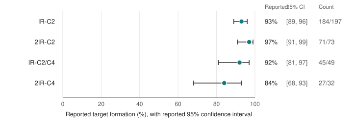

# di-mechanosynthesis

This project investigates computational models of mechanically controlled carbon transfer on hydrogenated
Si(100). The initial reference is the IR-C2 donation pathway reported by Cowie et al. [1]. In that pathway, a
germanium-based molecular tool transfers a C2 unit to a pair of dangling bonds on a hydrogen-passivated silicon
surface under inverted-mode scanning tunnelling microscopy. The present work defines candidate structures for the
tool and an electronic-structure validation protocol, which are prerequisites for modelling the coupled
tool–surface system. The repository is an active research record that is revised as sources are examined and
calculations are specified. It reports one engine-validation attempt, E-01, which stopped before producing any
converged result ([results/e01](results/e01/README.md)). It contains no converged quantum-chemistry results, and it
does not reproduce any experiment, model or calculation from the benchmark study.

  

Figure 1. Heavy atoms of the proposed activated donor candidate EAOGe-C2• (C17H27GeO3), drawn from the unchanged
coordinates in
[`structures/donor-activated-EAOGe-C2-radical.extxyz`](structures/donor-activated-EAOGe-C2-radical.extxyz). The
geometry is an unoptimized RDKit ETKDGv3 embedding proposed as a calculation input. It is neither a validated
structure nor the benchmark authors' coordinate set. Hydrogen atoms are omitted, and Cα and Cβ denote atoms `D-Ca`
and `D-Cb`. Rendering details are given in [docs/donor-candidates.md](docs/donor-candidates.md).

## Background

Inverted-mode scanning tunnelling microscopy (IM-STM) was introduced by Barrera et al. as a means of performing
mechanically controlled chemical reactions for atomically precise fabrication [2]. Tall molecules deposited
sparsely on a Si(100) sample image the apex of a flat silicon probe chip [1, 2]. Because the same molecules can react with
that apex, the two sides of the tunnel junction act as reagents positioned with sub-ångström precision. Blue et al.
subsequently reported positionally controlled donation of carbon and abstraction of silicon on atomically clean
Si(100) [3].

The molecular tool used by Cowie et al., EAOGe-C2I, is a germanium-substituted adamantane. It carries a C2 group
capped by iodine and three OH-terminated legs that anchor the molecule to the silicon sample [1]. The build site
is the hydrogen-passivated Si(100) apex of the probe chip, which is pre-patterned with reactive dangling-bond
sites. In the reaction considered here, the de-iodinated tool is positioned with its distal carbon atom beneath an
inter-row dangling-bond (IR-DB) pair, and it transfers its C2 unit to the build site.

## The benchmark study

Cowie et al. report atomically precise mechanosynthesis of carbon structures on hydrogenated Si(100) by IM-STM at
4 K [1]. The work is a preprint (arXiv:2605.27250v1, submitted 26 May 2026), and no peer-review status is claimed
for it here. The authors state that Supplementary Information is available upon request, but this project has not
obtained it. Figure 2 shows the per-interaction target formation that the authors report for four build targets.
The exact values are tabulated in [docs/benchmark.md](docs/benchmark.md) and in the chart input
[`tools/benchmark-reported-outcomes.tsv`](tools/benchmark-reported-outcomes.tsv). The counts are not multiplied
here into a build-success probability.

  

Figure 2. Per-interaction target formation reported by Cowie et al. [1]
([arXiv:2605.27250v1](https://arxiv.org/abs/2605.27250), section "Positional and chemical control of
mechanosynthetic donation"). Points mark the reported percentages and bars the reported 95% confidence intervals,
and the reported counts are listed at right. These are the authors' experimental per-interaction outcomes. They
are neither calculations by this project nor independent full-build yields or throughput estimates. The chart is
drawn by [`tools/render_outcomes_chart.py`](tools/render_outcomes_chart.py) from the reported values, without
recomputation.

The same paper proposes a mechanism for IR-C2 formation based on a QM/MM model that combines xTB (GFN0) with DFT
(ωB97X-D3) [1, Fig. 3]. The mechanism proceeds in three steps:

1. The de-iodinated tool is positioned beneath an IR-DB pair.
2. A first C–Si bond forms as the tool approaches.
3. The Ge–C bond cleaves on retraction, transferring the C2 unit.

The authors present the configuration shown as one representative leg-binding arrangement among several. The
mechanism is a computational proposal, distinct from the experimental counts, and it has not been reproduced here.
A fuller account with locators is given in [docs/benchmark.md](docs/benchmark.md).

## Research aims

The longer-term objective is a reviewed and reproducible computational description of mechanically controlled
reactions. Tool approach, contact and retraction would be described along controlled mechanical coordinates.
Individual donation and abstraction events would be characterized as reaction primitives with defined inputs,
observables and limits of validity. Energy landscapes along these coordinates would then be evaluated
reproducibly, including competing and off-target channels and the dependence of outcomes on approach depth, step
size, lateral offset and tool conformation. Once primitives have been validated, the same framework could be used
to study how they might be sequenced into larger atomically precise structures. Questions of throughput, error
handling and repair are treated as hypotheses until evidence addresses them. These capabilities do not yet exist.

## Present scope

Two candidate geometries represent the benchmark tool in its iodinated (precursor) and de-iodinated (activated)
forms.

| Candidate | Atoms | Formula | Charge / multiplicity |
|---|---|---|---|
| Precursor | 49 | C17H27GeIO3 | 0 / 1 |
| Activated | 48 | C17H27GeO3 | 0 / 2 |

Both geometries are RDKit ETKDGv3 distance-geometry embeddings with seed 20260916 [13], obtained without a force
field, quantum-chemical step or relaxation. Every atom carries a stable identifier, and the all-electron counts of
238 and 185 have the parity expected for a singlet and a doublet respectively. The identity of the donor rests on
literature statements recorded in the project's original reconstruction notes. The coordinates have not been
compared with the benchmark authors' supplementary coordinates. The atom-mapped SMILES, the identifier table and
the Figure 1 rendering method are given in [docs/donor-candidates.md](docs/donor-candidates.md), and the
coordinate files are described in [structures/README.md](structures/README.md).

The reconstruction also defined three unoptimized silicon surface models. The first is a periodic H:Si(100)-(2×1)
slab with one IR-DB pair; the second is a finite cluster built with the same pair rule; the third is a clean
Si(100)-(2×1) comparator cluster with a C2 placeholder. They were constructed on an ASE `diamond100` lattice [14]
with geometric dimer formation and hydrogen capping. Their coordinate files are not published, because they are
not inputs to the first calculation and they contain placeholder geometry.

The first calculation, designated E-01, asks whether the selected engine setup runs correctly on the two free donor
candidates at fixed geometry. The setup is Psi4 1.11 with the ωB97X-D3 functional, 6-31G(d,p) on all atoms except
iodine, and LANL2DZ with its effective core potential on iodine [6, 7]. The criteria cover SCF convergence from
several initial guesses, agreement between analytic and finite-difference gradients, spin contamination and
run-to-run reproducibility, with a radical-localization hypothesis for the activated donor reported separately.
The prospective protocol in [docs/e01-method-specification.md](docs/e01-method-specification.md) records the
preparation; its open clarifications were settled by review before the run, and the configuration actually used is
[results/e01/method-config.json](results/e01/method-config.json) [21].

E-01 was executed once on 2026-09-24. The precursor stopped at its first SCF job: Psi4 aborted during conventional
integral setup with the error `PSIO_ERROR: 17 (Incorrect block start address)` after 852 s; no SCF iteration was
printed. No converged electronic energy or gradient of either donor was produced, and every dependent criterion is
INDETERMINATE. The
activated donor was not run, because the failure may affect the shared configuration. The cause has not been
diagnosed. A source-level postmortem of the engine's input/output code and a bounded, read-only static survey of
the installed build identified no cause, and no exact executable diagnostic could be specified from the evidence
they obtained [25, 26]. The attempt is therefore closed as technically BLOCKED and scientifically INDETERMINATE
[27]. A conditional pathway to the error in the engine's source text is not established as the cause and is
neither established nor excluded; disk capacity likewise remains neither established nor excluded as a
contributor. The report, the postmortem ([results/e01/postmortem.md](results/e01/postmortem.md)), the
machine-readable outcome and the redacted engine output are in [results/e01](results/e01/README.md) [21].

Whether Psi4 1.11 provides each capability the calculation requires is examined in
[docs/engine-capability-status.md](docs/engine-capability-status.md). That record combines the development manual
(version string `1.12a1.dev35`) [7] and two source files from the `v1.11` tag [9, 10] with evidence from the
installed build [20, 21, 26]. The installation, the per-element basis construction with the iodine core potential
(46 core electrons) and the composition of the functional as printed by the engine are established for this
build, and the configured dispersion route was exercised in a dispersion-only check. Analytic gradients with the
core potential, ⟨S²⟩ reporting for unrestricted Kohn–Sham references, Löwdin spins and SCF behaviour at this size
remain unverified, because no SCF completed. The static survey recorded which input/output library names the
installed build exports, but an exported name establishes name availability only, not ABI compatibility,
initialization or callability, and the installed type widths that a diagnostic would need remain unresolved
[26]. Whether the
`wB97X-D3` entry is equivalent to the functional used in the benchmark calculations has not been established.

## Evidence classification and provenance

Scientific claims are classified by their underlying evidence as experimentally demonstrated (`[EXP]`),
computationally reproduced by this project (`[COMP-REPRO]`), computationally predicted (`[COMP-PRED]`),
literature-derived (`[LIT]`), agent-proposed (`[AGENT]`) or speculative (`[SPEC]`). The literature-derived label
records provenance alongside the underlying class. An unavailable input is marked `[GAP]` and blocks the claims
that depend on it. Classifications are not upgraded by restatement, summary or agreement between agents, and
output from language models is never treated as physical evidence. The rules are set out in
[docs/evidence-policy.md](docs/evidence-policy.md).

Every public file is listed with its SHA256 in [provenance/EXPORT-MANIFEST.md](provenance/EXPORT-MANIFEST.md),
which excludes itself from its own table. Where a file was adapted from a private working record, the manifest
states the change and gives the hash of the original. Both figures are drawn directly from repository data by the
included scripts. A software capability is accepted only when it is shown for the exact version used.

The work is coordinated through a separate orchestration and review system, Dodging Infinity. That system
authorizes bounded tasks, conducts independent review and records evidence status. This repository holds the
scientific content, and none of its documents authorizes computation. Conventions for contributors and automated
agents are given in [AGENTS.md](AGENTS.md).

## Computational tools

The table lists each tool with its current status in the project. Numbers refer to the catalogue in
[docs/SOURCES.md](docs/SOURCES.md).

| Tool | Status here | Role |
|---|---|---|
| RDKit [13]; ASE [14] | Used in preparation, without quantum chemistry | Donor-candidate embeddings; structure building and extxyz input and output |
| Psi4 1.11 [6] | Installed from conda-forge in a project-local environment [20]; installation and basis construction checked; the E-01 precursor SCF aborted during integral setup [21]; a source-level postmortem and a static survey of the installed build identified no cause [25, 26] | Electronic-structure engine for the first calculation |
| simple-dftd3 1.6.0 [22] | Installed with Psi4 [20]; exercised in a dispersion-only check without SCF | D3 dispersion term of ωB97X-D3 |
| AiiDA [12] | Used to store the hashed E-01 preparation and run records; not used to execute calculations | Computational provenance |
| xtb [15] | Candidate, documentation only | GFN0-xTB, the benchmark's QM/MM partner method; the xtb documentation describes a GFN0 parameter file |
| CP2K [16] | Candidate, documentation only | Periodic and QM/MM engine whose manual documents an internal GFN0-xTB option |
| tblite [17] | Candidate, documentation only | Tight-binding library whose documentation lists GFN1-xTB, GFN2-xTB and IPEA1-xTB but not GFN0; not a substitute for the GFN0 route |
| QCFractal [18]; OVITO [19] | Candidates, documentation only | Alternative workflow store (deferred); rendering of computed coordinates |

## Repository contents

The public export covers the donor candidates, their documentation and the E-01 result. The surface-model
coordinate files and the project's private working records are omitted, and the manifest lists each omission with
its reason.

| Path | Contents |
|---|---|
| [docs/SOURCES.md](docs/SOURCES.md) | Numbered catalogue of literature, software documentation, method sources and figure inputs |
| [docs/benchmark.md](docs/benchmark.md) | Attribution, reported observations and proposed mechanism of the benchmark study |
| [docs/evidence-policy.md](docs/evidence-policy.md) | Evidence classes, classification rules and provenance requirements |
| [docs/donor-candidates.md](docs/donor-candidates.md) | Donor identity, molecular graph, atom identifiers, electron bookkeeping, surface models and Figure 1 method |
| [docs/e01-method-specification.md](docs/e01-method-specification.md) | Prospective specification of the first calculation, kept as the preparation record |
| [docs/engine-capability-status.md](docs/engine-capability-status.md) | Capabilities of Psi4 1.11 as established, or not, by archived primary sources and the installed build |
| [results/e01/README.md](results/e01/README.md) | E-01 result: the stopped attempt, runtime observations, hypotheses and diagnostic closeout |
| [results/e01/postmortem.md](results/e01/postmortem.md) | E-01 postmortem and installed-build survey: the conditional source-level hypothesis, survey coverage and limits, and remaining gaps |
| [results/e01/outcome.json](results/e01/outcome.json) | Machine-readable E-01 outcome with source hashes |
| [results/e01/method-config.json](results/e01/method-config.json) | Method and environment configuration used by E-01 |
| [results/e01/raw/](results/e01/raw/) | Engine output, error text, job input and classification of the precursor, redacted where stated |
| [docs/figures/activated-donor.svg](docs/figures/activated-donor.svg) | Figure 1 |
| [docs/figures/benchmark-outcomes.svg](docs/figures/benchmark-outcomes.svg) | Figure 2 |
| [tools/render_donor_plate.py](tools/render_donor_plate.py) | Figure 1 renderer, with its bond table [tools/activated-donor-bonds.tsv](tools/activated-donor-bonds.tsv) |
| [tools/render_outcomes_chart.py](tools/render_outcomes_chart.py) | Figure 2 renderer, with its input [tools/benchmark-reported-outcomes.tsv](tools/benchmark-reported-outcomes.tsv) |
| [structures/](structures/README.md) | Donor-candidate coordinate files |
| [AGENTS.md](AGENTS.md) | Conventions for contributors and automated agents |
| [provenance/EXPORT-MANIFEST.md](provenance/EXPORT-MANIFEST.md) | Per-file SHA256, derivation and redaction statements |

## Contributing and licence

Corrections are welcome, particularly those that bring a primary source to bear on a statement marked unverified.
An issue should identify the source exactly, by identifier, version and page, section or line, and should name the
statement it supports or contradicts. Claims without a checkable source are recorded as proposals rather than
evidence.

No licence has been selected for this repository, and no licence is therefore granted. Third-party works are cited
rather than included. Paper text, figures, supplementary material and vendor source code were excluded from this
export pending redistribution review. Work that builds on the benchmark should cite the original preprint [1].

## References

1. Cowie, M. *et al.* Atomically precise mechanosynthesis of carbon structures on hydrogenated Si(100) by
   inverted-mode STM. arXiv:2605.27250v1 (2026). <https://doi.org/10.48550/arXiv.2605.27250>
2. Barrera, E. *et al.* Inverted-Mode Scanning Tunneling Microscopy for Atomically Precise Fabrication.
   arXiv:2512.24431 (2025). <https://doi.org/10.48550/arXiv.2512.24431>
3. Blue, B. *et al.* Towards Atom-by-Atom Fabrication: Mechanosynthetic donation and abstraction.
   arXiv:2606.13876 (2026). <https://doi.org/10.48550/arXiv.2606.13876>

References [4] to [27], covering further literature, software documentation, source files and the project's own
E-01 records, are catalogued with versions, locators, verification basis and limitations in
[docs/SOURCES.md](docs/SOURCES.md), which uses the same numbering.
