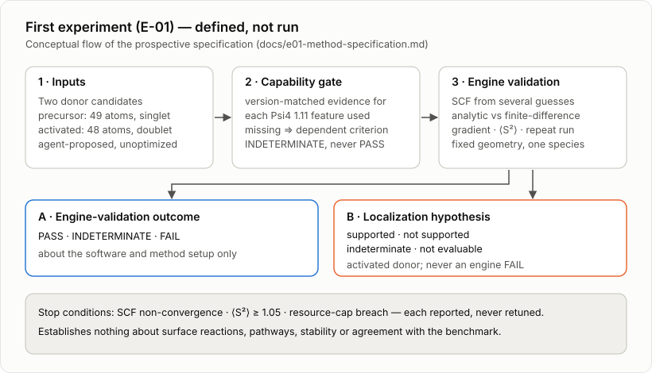

# First experiment (E-01): donor-only engine validation — prospective specification

**Status: defined, not run.** This page adapts the project's accepted method definition for public reading. The
thresholds are **prospective engineering choices**, not literature values unless stated otherwise. Several engine
capabilities it depends on are **unverified** for the selected version (see
[engine-capability-status.md](engine-capability-status.md)). The definition itself is a reconstruction-era
`[AGENT]` document: it binds what would be measured, and it is not evidence of anything. The source behind
each specification element, and whether it is a primary-source fact or a proposed choice, is listed in
[SOURCES.md](SOURCES.md) §3.

  

## 1. Question and scope

Does the selected engine, functional, basis/effective-core-potential and open-shell setup run correctly on the
two free donor candidates at fixed geometry, and what descriptors does it report?

| In scope | Out of scope |
|---|---|
| Single points and gradients of the two free donors at their given geometries | Relaxation or coordinate repair, surface or combined tool–surface systems, trajectories, barriers, reaction products |
| Engine and method validation outcomes | Any claim about ground states, stability, pathways or agreement with the benchmark |

## 2. Inputs and method

| Item | Definition |
|---|---|
| Species | Precursor `donor-precursor-EAOGe-C2I.extxyz` (49 atoms, charge 0, multiplicity 1, restricted Kohn–Sham). Activated `donor-activated-EAOGe-C2-radical.extxyz` (48 atoms, charge 0, multiplicity 2, unrestricted Kohn–Sham). Both unoptimized ETKDG embeddings. |
| Engine | Psi4 1.11 |
| Functional | ωB97X-D3 |
| Basis | 6-31G(d,p) on all atoms except iodine; LANL2DZ with its effective core potential on iodine |
| Grid | Engine default |
| SCF convergence | 10⁻⁸ Eh energy and 10⁻⁸ RMS density for any quantity entering a criterion; at most 100 iterations; non-convergence is a stop, with no silent damping or level-shift retuning |
| Initial guesses | Several per species: core Hamiltonian, SAD and a broken-symmetry guess (see §5 for the open question on the precursor) |
| Diagnostic | Hartree–Fock RHF→UHF stability check for the precursor, as a separate, non-equivalent diagnostic |
| Resource envelope | At most 8 cores and 16 GB, one species at a time, 2 h aggregate wall time per species across all sub-calculations. A breach is a reported stop, not a retry. |

## 3. Engine-validation criteria (about the software and method setup only)

| Observable | PASS | INDETERMINATE | FAIL |
|---|---|---|---|
| SCF convergence (both species, every guess) | all converged within 100 iterations | some converged (report which) | none converged |
| Multiple-guess consistency | all converged solutions agree within 10⁻⁶ Eh and ⟨S²⟩ within 0.01 | solutions differ (report lowest and spread) | — (a spread is a finding, not an engine failure) |
| RHF→UHF stability (precursor, Hartree–Fock) | stable | unstable (report) | — |
| ⟨S²⟩ of the activated donor (lowest-energy solution) | deviation from 0.75 below 0.10 | 0.10 up to 0.30 | 0.30 or more; a method limitation only, never a ground-state claim |
| Analytic vs finite-difference gradient | per §3.1 | per §3.1 | per §3.1 |
| Reproducibility (repeat run) | ΔE ≤ 10⁻⁸ Eh and Δg ≤ 10⁻⁶ au | — | otherwise (reproducibility only, not gradient correctness) |
| Resource envelope | within | — | breach: stop, reported |

**There is no Kohn–Sham stability criterion.** Whether Psi4 1.11 can perform Kohn–Sham stability analysis for this
functional is **unverified**, and nothing here claims it is impossible.
- **Davidson algorithm:** the archived development documentation limits its Kohn–Sham support to LDA functionals
  (as of 1.7).
- **Direct-inversion algorithm:** that documentation is silent on its Kohn–Sham coverage in the lines inspected,
  so the question is unresolved.
- **Root-following:** the version-tagged source restricts only stability *root-following* to UHF references.

Stability is always reported as indeterminate. Several initial guesses do not prove stability or a ground state.

### 3.1 Analytic vs finite-difference gradient rule

- **Finite difference:** central differences gfd(h) with h = 0.005 bohr and h/2 = 0.0025 bohr. Every
  displaced-point SCF is converged to 10⁻¹⁰ Eh / 10⁻¹⁰, otherwise that component is "SCF-unmet".
- **Sampled components:** `D-Cb` x, y, z and one leg hydrogen x, y, z.
- **Errors per component:**
  - eabs = |ga − gfd(h)|
  - erel = eabs / max(|gfd|, 10⁻⁴ au)
  - step consistency s = |gfd(h) − gfd(h/2)|
- **Aggregation:** the maximum over sampled components.
- **Floor:** components with |gfd| < 10⁻⁴ au are judged by absolute error only. The relative-error
  conditions below apply only where |gfd| ≥ 10⁻⁴ au.

Outcomes, evaluated in this order:
- **FAIL:** any eabs > 10⁻⁴ au, or (|gfd| ≥ 10⁻⁴ au and erel > 10⁻²).
- **INDETERMINATE:** any component SCF-unmet, any s > 10⁻⁵ au, any 10⁻⁵ < eabs ≤ 10⁻⁴ au, or any
  (|gfd| ≥ 10⁻⁴ au and 10⁻³ < erel ≤ 10⁻²).
- **PASS:** otherwise.

If analytic gradients are unavailable for this setup, the finite-difference gradient is the gradient, and this
row reports "analytic unavailable" as INDETERMINATE.

## 4. Localization hypothesis (activated donor; reported separately, never an engine FAIL)

- **Guess set G:** exactly three unrestricted runs (core Hamiltonian, SAD, broken symmetry).
- **Observations per guess g:** convergence and, if converged, energy Eg, ⟨S²⟩g and the
  Löwdin spin population *p*g on `D-Cb`.
- **Degeneracy:** two solutions are degenerate if |ΔE| ≤ 10⁻⁶ Eh.
- **Reference solution L:** the converged solution with the lowest energy. Energies within 10⁻⁶ Eh count as
  tied; ties are resolved by the lowest ⟨S²⟩, then by guess order (core Hamiltonian, SAD, broken symmetry).
- **Population used by the rules:** *p* = *p*L, the population of solution L.
- **Spread:** Δ*p* is the maximum minus the minimum of *p*g over converged guesses.

Exactly one outcome applies, taking the first rule that matches:

1. **Not evaluable** if any of these holds:
   - a stop fired
   - any guess failed to converge
   - Löwdin spins or ⟨S²⟩ are unavailable or unverified in the installed version
   - any required value is missing or non-finite
2. **Indeterminate (unstable description):** 0.10 ≤ ⟨S²⟩L − 0.75, or any pair of converged solutions
   is energetically distinct.
3. **Indeterminate (guess-dependent):** all solutions are degenerate and Δ*p* > 0.10 e.
4. **Indeterminate (intermediate):** 0.50 e ≤ *p* < 0.80 e.
5. **Supported:** *p* ≥ 0.80 e.
6. **Not supported:** *p* < 0.50 e.

"Supported" never means "ground state". Spin populations are model-dependent descriptors, not reaction or
benchmark-parity evidence.

## 5. Stop conditions and open clarifications

- **Stop conditions:** SCF non-convergence, ⟨S²⟩ ≥ 1.05, or a resource-envelope breach. Each is reported as a
  result and never silently retuned.
- **Clarified:** the ⟨S²⟩ 0.01 tolerance belongs to the engine-validation multiple-guess row (§3). The statement
  that no 0.01 tolerance is used applies only to the localization hypothesis (§4). The two sections have separate
  scopes.
- **Still open**, all technical clarifications to be settled before any run:
  - whether the precursor also runs unrestricted, and its exact guess set
  - which leg hydrogen and which species the finite-difference check samples
  - whether the full set of sub-calculations fits the per-species budget
  - how a run proceeds if ⟨S²⟩ is unavailable, since the ⟨S²⟩ ≥ 1.05 stop could then not be evaluated

## 6. What E-01 can and cannot establish

- **Can establish:** whether the engine, functional, basis/effective-core-potential and open-shell setup run on the
  reconstructed donor candidates, and which descriptors they report.
- **Cannot establish:** anything about the surface reaction, the pathway, stability, or parity with the
  benchmark's calculations.
